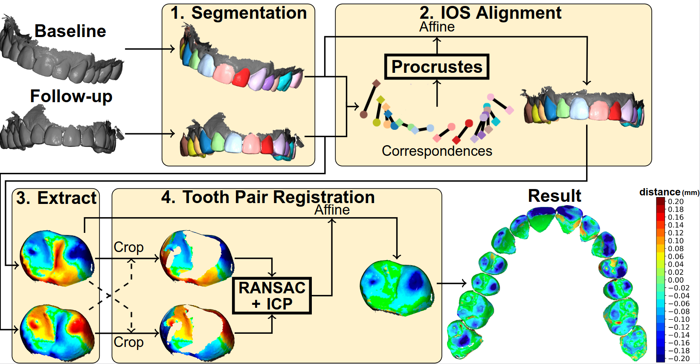

# ToothWear

Welcome to the repository accompanying the paper *Automated visualization and detection of tooth wear using intra-oral scans*.

## Methodology



## Install with Pip

``` shell
pip install -r requirements.txt
```

## Replicate

When trying to replicate this work, the tooth segmentations should be predicted, before the tooth wear can be measured.

### Tooth segmentation

The publicly available algorithm *StratifiedTSegNet* was used to predict tooth segmentations in intra-oral scans ([link](https://grand-challenge.org/algorithms/stratified-transformer-instseg/)). The algorithm should result in a JSON file specifies for each point either an FDI label (11-48) or the gingiva label (0).

### Tooth wear measurements

`height.py` is the main file of this repository. After running the tooth wear analysis, the measurments should be stored in an Excel file for an easy method of looking back at the results. Furthermore, the results can be visualized by setting `verbose=True` at several locations of the code.

### Comparison to manual measurements

The scripts in the `3dwa` directory perform the tooth wear measurements based on manually extracted tooth pairs, such as based on the 3DWA protocol.

### Evaluation

The file `binary_stats.py` can be run to evaluate the automated method compared to the manual measurements. The results are provided in the `figures` directory, which includes confusion matrices for detection of teeth with tooth wear lesions.

## Queries

For inquiries about this project, please contact [Niels.vanNistelrooij at radboudumc.nl](mailto:niels.vannistelrooij@radboudumc.nl).
